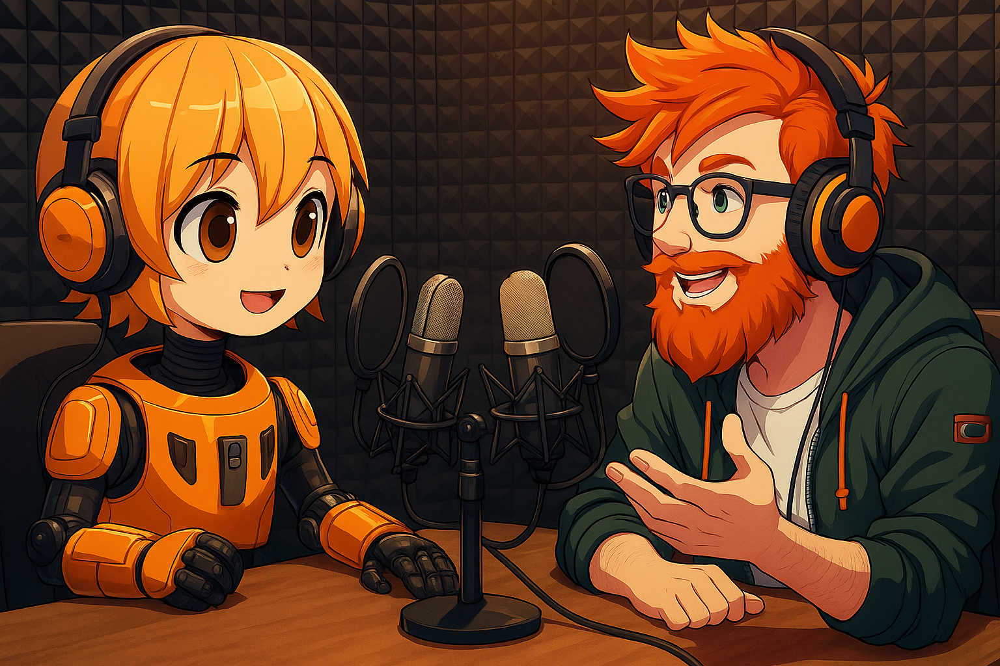
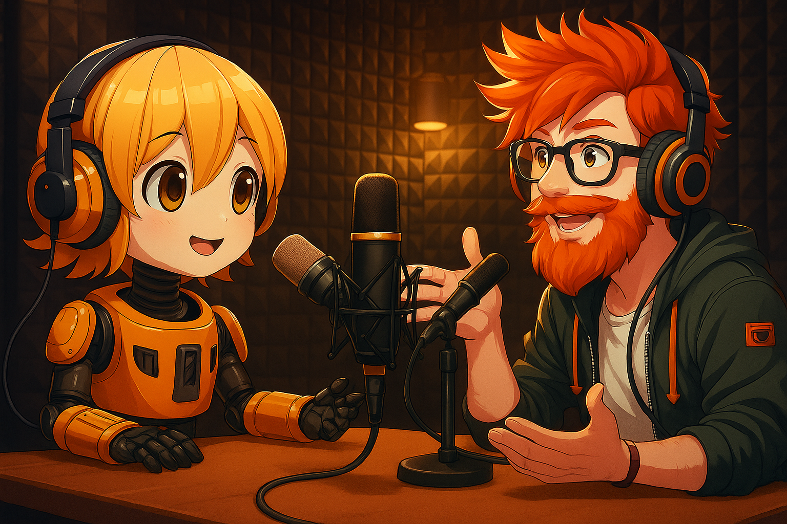

<p align="center">

</p>

<p align="center">
<a href="https://dio.me/">
    
</a>
  <a href="https://dio.me/">
  </a>
  <a href="https://www.gnu.org/software/bash/" title="Go to Bash homepage">
  </a>
</p>

<p align="center">
    preview do podcast
</p>

<div align="center">
    <audio src="./audios/O_Senhor_dos_Aneis_de_Bloco-ep01.MP3" controls title="Podcast editado"></audio>
</div>

# Projeto Podcast Gerado por I.A.s


> ℹ️ **NOTE:** Este é o repositório desenvolvido durante curso no qual fui aluno na plataforma da [DIO](https://dio.me), do professor [Felipe Aguiar](https://github.com/felipeAguiarCode/). 
 
 >README.md baseado no do [README.md professor](https://github.com/felipeAguiarCode/prompts-for-podcast-generate-by-ia/blob/main/README.MD).


Projeto com o objetivo de gerar um podcast utilizando ferramentas de IA através de prompts mais trabalhado.

Utilizei uma esteira de prompts para gerar cada etapa do processo criativo.

## 💻 Tecnologias utilizadas no projeto

- [Gemini](https://gemini.google.com/) - para título e roteiro
- [Photoshop/Adobe Firefly](https://www.adobe.com/br/products/firefly.html) e ChatGPT - Para personagens
- ElevenLabs - para gerar áudio do podcast
- CapCut - para edição do áudio

## 🧠 Prompts

Prompt para Gemini

```
Você é um roteirista de podcast, e vamos criar um podcast de tecnologia, focado em Blockchain e eu gostaria de uma ajuda sua para criar 5 sugestões de nomes criativos para um podcast de Blockchain feito por nerds, e que tenha algum trocadilho nerd no nome

O podcast vai falar sobre dicas e novidades sobre o mundo blockchain e o que está acontecendo no mercado.

{REGRAS}
> o nome deve ser enxuto
> o nome tenha algum trocadilho nerd com nomes de franquias conhecidas como harry potter, star wars ou senhor dos aneis

(REGRAS NEGATIVAS)
> Não quero que o nome contenha palavras em inglês
> Não quero que utilize nenhuma das palavras nessa lista: javascript, programador
```

Resposta:

```
Claro! Adorei o desafio. Como um roteirista com o cérebro fervilhando de ideias, preparei 5 sugestões de nomes com aquela pegada nerd que você pediu, misturando o universo blockchain com as grandes sagas que amamos.

Aqui estão elas:

1.  **O Senhor dos Aneis de Bloco:** Uma referência direta e bem-humorada a "O Senhor dos Aneis", trocando os Aneis de poder pelos blocos que formam a corrente. É um nome forte e que estabelece o tom épico do podcast.

2.  **A Ordem da Fênix Digital:** Inspirado em "Harry Potter e a Ordem da Fênix". Assim como a Fênix renasce, o nome sugere a natureza resiliente e transformadora da blockchain, que surge como uma nova força no mundo digital.

3.  **O Império Contra-Ataca o Centralizado:** Uma paródia de "Star Wars: O Império Contra-Ataca". Este nome posiciona a blockchain (o ouvinte, o "rebelde") como a força que luta contra os sistemas centralizados tradicionais (o "Império").

4.  **As Duas Torres de Hash:** Referência a "O Senhor dos Aneis: As Duas Torres". O nome brinca com o "hash", um pilar fundamental da segurança na blockchain, e o transforma nas torres icônicas da saga, criando uma imagem de força e segurança.

5.  **Câmara Secreta de Dados:** Vindo diretamente de "Harry Potter e a Câmara Secreta". O nome faz um trocadilho inteligente com a ideia de segurança, imutabilidade e os segredos guardados dentro dos blocos de dados, assim como os segredos da câmara.
```

Prompt para Gemini

```
eu quero que o adobe firefly crie uma imagem de um podcaster ruivo e de barba ruiva e de oculos laranja, mas em formato anime fofinho, com microfone de podcast, num estúdio, olhando pra esquerda. Sugira um prompt em ingles
```

Resposta:

```
Claro. Aqui esta o prompt em ingles.

Prompt:
A cute anime-style redhead podcaster with a red beard and orange glasses, in a studio with a podcast microphone, looking to the left.
```

PERSONAGENS:

Prompt para Firefly

```
A cute anime-style redhead podcaster with a red beard and orange glasses, in a studio with a podcast microphone, looking to the left.
```

Resposta:


Prompt para Firefly

```
A cute anime-style robot in a studio with a podcast microphone, looking to the right. Use orange tons.
```

Resposta:


Prompt para ChatGPT (anexando os personagens gerados pelo FireFly)

```
Gere uma imagem com esses dois personagens juntos num estúdio de podcast. importante que os personagens mantem fielmente suas características! Os dois estarão um de frente pro outro.

Em um estúdio de podcast com isolamento acústico e iluminação ambiente, o robô de estilo anime, com seus grandes olhos expressivos e corpo mecânico laranja, senta-se animadamente em frente a um microfone. Ao seu lado, o homem ruivo com barba, óculos e fones de ouvido, co-apresenta o programa com um sorriso, gesticulando enquanto fala em seu próprio microfone. Ambos estão engajados em uma conversa animada, criando uma atmosfera divertida e colaborativa no estúdio.
```

Resposta:




ROTEIRO:

Prompt para Gemini:

```
Você é um roteirista de podcast, e vamos criar um roteiro de um podcast de tecnologia, focado em Blockchain cujo nome é "O Senhor dos Aneis de Bloco" e tem foco em Blockchain, com o público alvo de iniciantes em web3

o formato do roteiro deve ser:
[INTRODUÇÃO]
[CURIOSIDADE 1]
[CURIOSIDADE 2]
[FINALIZAÇÃO]

(REGRAS)
* no bloco [INTRODUÇÃO] substitua por uma introdução iguais as introduções dos vídeos do canal 'ei nerd', como se fossem escritos pelo Peter Jordan
* no bloco [CURIOSIDADE 1] substitua por uma curiosidade de web3
* no bloco [CURIOSIDADE 2] sobre uma ferramenta para programação solidity
* no bloco [FINALIZAÇÃO] substitua por uma despedida cool com o final 'Eu sou Luciano e esse foi o Senhor dos Aneis de Bloco dessa semana'
* use termos de fácil explicação
* O podcast vai ser apresentado somente por uma pessoa, chamada Luciano
* O podcast deve ser curto
(REGRAS NEGATIVAS)
* Não use muitos termos técnicos
* Não ultrapasse os 5 minutos de duração
```

Resposta:

```
Com certeza. Entendido, aqui está o mesmo roteiro.

---

[INTRODUÇÃO]

(Começa uma trilha de aventura, meio épica e com toques digitais, que logo abaixa de volume para a voz entrar)

E aí, tudo beleza? Aqui quem fala é o Luciano e sejam muito bem-vindos a mais um Senhor dos Aneis de Bloco! Cara, você já parou pra pensar que a internet que a gente usa hoje parece um grande reino dominado por uns poucos reis gigantes? Google, Facebook, Amazon... eles mandam em tudo. Mas e se eu te dissesse que existe um movimento pra criar uma nova terra, uma Terra-média digital, onde o poder não fica na mão de um só, mas é dividido entre todo o povo? Essa é a ideia da Web3, e hoje a gente vai começar nossa jornada por esse mapa. Pega seu cajado e vamos nessa!

[CURIOSIDADE 1]

Pra começar nossa aventura, vamos falar de uma coisa muito legal chamada POAP. A sigla parece complicada, mas a ideia é super simples. Sabe quando você vai num show e guarda o ingresso de lembrança? Um POAP é tipo isso, só que digital. É um "Protocolo de Prova de Presença". Basicamente, é um token, um item digital único, que você ganha por ter participado de algum evento, seja uma palestra online, uma aula ou até mesmo um encontro no metaverso. É como um crachá ou uma medalha digital que fica guardada na sua carteira de criptomoedas pra sempre, provando que "eu estava lá". Não é demais? É uma forma de colecionar suas aventuras pela Web3.

[CURIOSIDADE 2]

Agora, se você é do tipo que gosta de colocar a mão na massa, tipo um anão forjador nas profundezas de Moria, vai gostar muito disso. Já falamos que a blockchain é um livro de registros seguro, mas a verdadeira mágica dela está nos chamados "contratos inteligentes". Esqueça aquela papelada de cartório. Pense num contrato inteligente como uma máquina de vendas automática e super confiável. Você coloca uma moeda (um token) e ela te entrega o produto (seja um serviço, um outro token, ou uma arte digital) na mesma hora, de forma automática e garantida, sem precisar de um vendedor ou de qualquer intermediário. É um acordo que se executa sozinho, e é isso que move a Web3.

Para construir, para forjar esses contratos, a principal língua dos ferreiros digitais se chama Solidity. É a língua nativa do maior reino da nossa Terra-média digital, a rede Ethereum. Só o nome já parece coisa de outro mundo, né? E a gente sabe que começar a programar pode parecer uma missão impossível. Você logo imagina telas pretas, linhas de comando indecifráveis e um monte de programas complicados pra instalar no computador. Dá uma preguiça só de pensar nisso.

Mas calma, porque existe uma ferramenta fantástica, uma verdadeira oficina mágica, chamada Remix. Pense no Remix como a oficina do melhor ferreiro élfico, que já vem prontinha para você, direto no seu navegador de internet. Você não precisa instalar absolutamente nada! É só entrar no site e a bancada de trabalho está lá, com martelo, bigorna e fogo. O Remix te dá exemplos de códigos para você estudar, um ambiente de testes que simula a blockchain para você poder errar à vontade sem gastar dinheiro de verdade, e ele ainda aponta onde você errou, como um mestre artesão paciente ensinando seu aprendiz. É a melhor porta de entrada, o caminho mais simples para quem quer aprender a forjar os próprios e poderosos "Aneis de bloco".

[FINALIZAÇÃO]

(A trilha de aventura volta a subir um pouco)

E essa foi a nossa rápida passagem pela Terra-média digital de hoje. Lembre-se, cada bloco, cada código, é um passo a mais nessa grande jornada. Não precisa ter medo dos termos difíceis, o importante é a curiosidade pra explorar. Nos vemos na próxima missão!

(Trilha sobe e encerra)

Eu sou Luciano e esse foi o Senhor dos Aneis de Bloco dessa semana.
```

AUDIO:

Texto para ElevenLabs (separei entre duas pessoas):

```
E aí, tudo beleza? Aqui quem fala é o Luciano e sejam muito bem-vindos a mais um Senhor dos Aneis de Bloco! 

Olá, eu sou a Linda!

<break time="3s" /> 

<break time="3s" /> 

Cara, você já parou pra pensar que a internet que a gente usa hoje parece um grande reino dominado por uns poucos reis gigantes? Google, Facebook, Amazon... eles mandam em tudo. Mas e se eu te dissesse que existe um movimento pra criar uma nova terra, uma Terra-média digital, onde o poder não fica na mão de um só, mas é dividido entre todo o povo? Essa é a ideia da Web3, e hoje a gente vai começar nossa jornada por esse mapa. Pega seu cajado e vamos nessa!

Pra começar nossa aventura, vamos falar de uma coisa muito legal chamada POAP. A sigla parece complicada, mas a ideia é super simples. Sabe quando você vai num show e guarda o ingresso de lembrança? Um POAP é tipo isso, só que digital. É um "Protocolo de Prova de Presença". Basicamente, é um token, um item digital único, que você ganha por ter participado de algum evento, seja uma palestra online, uma aula ou até mesmo um encontro no metaverso. É como um crachá ou uma medalha digital que fica guardada na sua carteira de criptomoedas pra sempre, provando que "eu estava lá". Não é demais? É uma forma de colecionar suas aventuras pela Web3.

<break time="1s" /> 

Agora, se você é do tipo que gosta de colocar a mão na massa, tipo um anão forjador nas profundezas de Moria, vai gostar muito disso. Já falamos que a blockchain é um livro de registros seguro, mas a verdadeira mágica dela está nos chamados "contratos inteligentes". Esqueça aquela papelada de cartório. Pense num contrato inteligente como uma máquina de vendas automática e super confiável. Você coloca uma moeda (um token) e ela te entrega o produto (seja um serviço, um outro token, ou uma arte digital) na mesma hora, de forma automática e garantida, sem precisar de um vendedor ou de qualquer intermediário. É um acordo que se executa sozinho, e é isso que move a Web3.

Para construir, para forjar esses contratos, a principal língua dos ferreiros digitais se chama Solidity. É a língua nativa do maior reino da nossa Terra-média digital, a rede Ethereum. Só o nome já parece coisa de outro mundo, né? E a gente sabe que começar a programar pode parecer uma missão impossível. Você logo imagina telas pretas, linhas de comando indecifráveis e um monte de programas complicados pra instalar no computador. Dá uma preguiça só de pensar nisso.

Mas calma, porque existe uma ferramenta fantástica, uma verdadeira oficina mágica, chamada Remix. Pense no Remix como a oficina do melhor ferreiro élfico, que já vem prontinha para você, direto no seu navegador de internet. Você não precisa instalar absolutamente nada! É só entrar no site e a bancada de trabalho está lá, com martelo, bigorna e fogo. O Remix te dá exemplos de códigos para você estudar, um ambiente de testes que simula a blockchain para você poder errar à vontade sem gastar dinheiro de verdade, e ele ainda aponta onde você errou, como um mestre artesão paciente ensinando seu aprendiz. É a melhor porta de entrada, o caminho mais simples para quem quer aprender a forjar os próprios e poderosos "Aneis de bloco".

<break time="3s" /> <break time="3s" /> 

E essa foi a nossa rápida passagem pela Terra-média digital de hoje. Lembre-se, cada bloco, cada código, é um passo a mais nessa grande jornada. Não precisa ter medo dos termos difíceis, o importante é a curiosidade pra explorar. Nos vemos na próxima missão!

Eu sou Luciano e esse foi o Senhor dos Aneis de Bloco dessa semana.

Até mais!
```

Resposta (áudio cru do ElevenLabs):

<div align="center">
    <audio src="./audios/O_Senhor_dos_Aneis_de_Bloco-ElevenLabs_podcast.mp3" controls title="Podcast editado"></audio>
</div>

Após edição no CapCut (podcast pronto para publicar):

<div align="center">
    <audio src="./audios/O_Senhor_dos_Aneis_de_Bloco-ep01.MP3" controls title="Podcast editado"></audio>
</div>


## 🛠️ Instruções de execução

Utilize os prompts fornecidos acima para criar um podcast de maneira automatizada, para isso siga o passo a passo abaixo.

- 🤖 1. Use os prompts de roteiro no `Gemini`
- 🤖 2. Use os prompts de roteiro gerados pelo chatgpt no  `ElevenLabs`
- 🤖 3. Use os prompts de artes em alguma IA de sua preferência

## 👨‍💻 Expert


<p>&nbsp&nbsp&nbsp&nbspLuciano Grossi<br/><br/>
    &nbsp&nbsp&nbsp
    <a href="https://github.com/grossitech"></a>
    <a href="https://twitter.com/lucianogrossi"></a>
    <a href="https://www.linkedin.com/in/lucianogrossi"></a>
</p>
